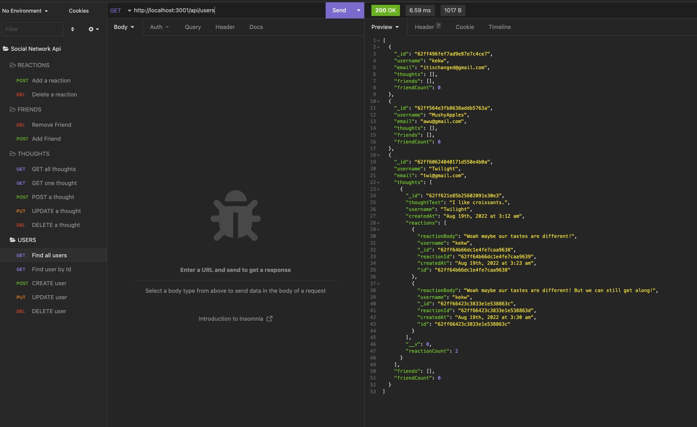
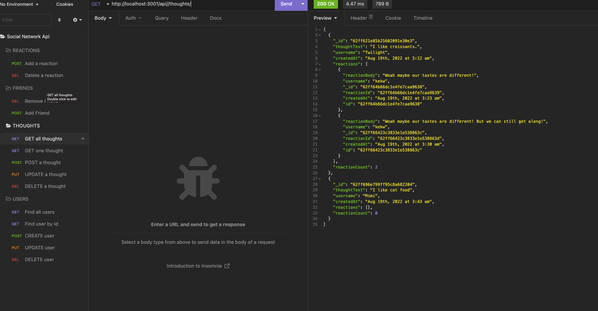
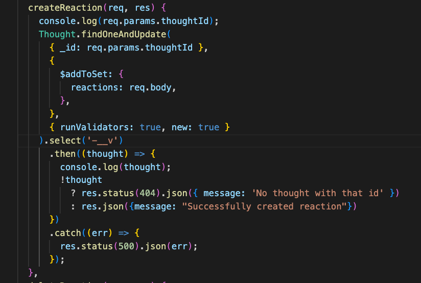

# FriendsNStuff-API

[](#license)

An API back end database for an e-commerce site that uses requests. It was built using Node.js, Express.js, MySQL and Sequelize.

## Description 
This application uses MongoDB, Mongoose ODM, Node, Express, and JS to implement a social network API where users can share their thoughts, react to their friend's thoughts, and add friends to their friend's list. 

## Technologies Used

- Node.js
- Express.js
- JavaScript
- MongoDB

## Table of Contents

* [Installation](#installation)
* [Usage](#usage)
* [Credits](#credits)
* [License](#license)
* [Contributing](#contributing)

## Installation
  1. Upload all files or fork this repository to a server with a Node.js runtime environment. 
  2. Run `npm -i` from the root directory to install dependencies for this app. 
  3. Run `node server.js` to start the server.

## Usage 
Run `node server.js` to start the server.

Access API endpoints to view, add, update, and delete users, thoughts, reactions, and friends.

Users:




Thoughts:



### Code Snippet



#### Code Snippet of creating a reaction, updating the reactions array in the thoughts model.


Walkthrough video: [Here](https://drive.google.com/file/d/1EfBMxvgYS3JIVXXWPdxiyM6PaDPoAh2g/view?usp=sharing)

## Credits
This application was built with the support of the resources and staff of the UCB Full Stack Full Time Coding Bootcamp Summer 2022. 

-W3 Schools


## License

```
MIT License
```

</details>

## Contributing
This project isn't currently acccepting contributions.

## Questions
- View my Github [profile](https://github.com/jeffz98)
- Contact me at my [email](mailto:jeffz98@berkeley.edu)